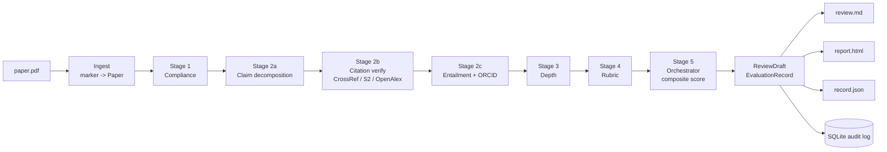
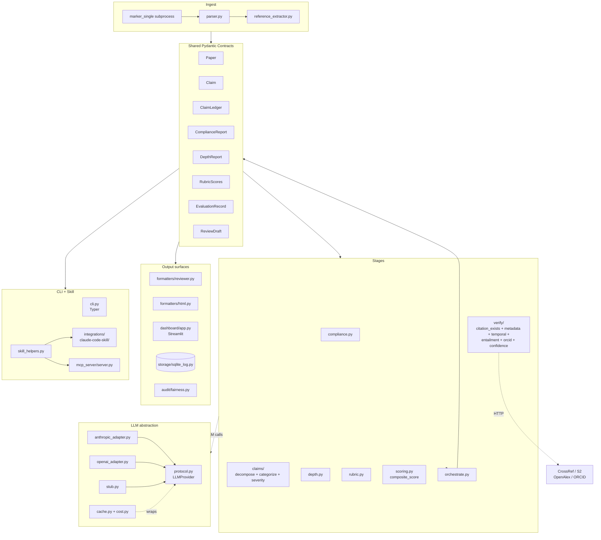
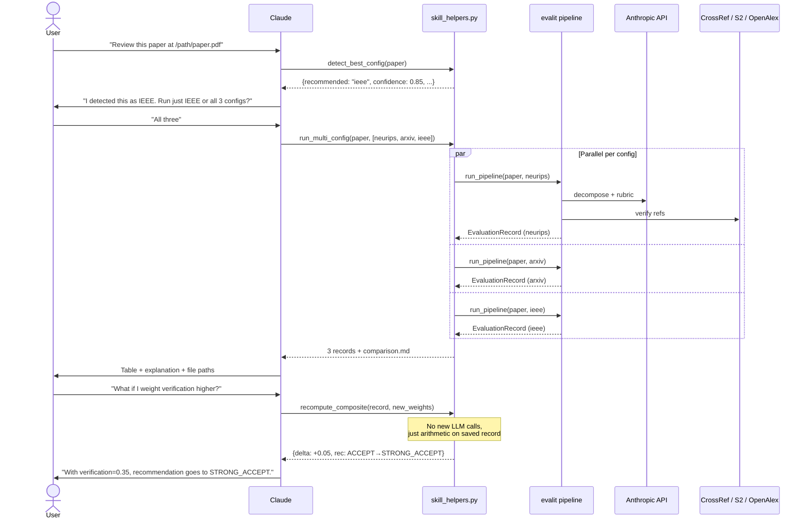

# evalit-4me

> Open-source reference implementation of a 5-layer AI evaluation framework for academic peer review — adapted from the IEEE chapter *AI Evaluation Frameworks for Assessing Project Proposals* (Talwekar).

Give `evalit-4me` a PDF of an academic paper. It returns a structured review draft — compliance triage, citation verification, depth scores, rubric assessment, and a composite recommendation — suitable for a reviewer-assist workflow.

Works as a CLI (`evalit review paper.pdf`), a Python library, a Streamlit dashboard, a Claude Code skill, or a Claude Desktop MCP server.

---

## Scope & responsible use

**evalit-4me is a reviewer-assist tool. It is not a reviewer replacement and it is not a gate.**

- **Outputs are inputs for a human reviewer.** The pipeline produces structured signals — claim-level citation verification, depth heuristics, rubric breakdown, compliance triage — so a reviewer can spend their limited time where it matters. It does not make accept/reject decisions.
- **Compliance triage (`PASS` / `CONDITIONAL` / `FAIL`) is a sort signal, not a gate.** `FAIL` means "a human should look at this first," never "auto-reject."
- **The composite score is a reviewer aid, not a threshold.** It exists to rank items in a reviewer's queue and to make per-stage contributions legible. It is not calibrated for automated accept/reject decisions, and we recommend against wiring it to one.
- **No AI-text detection.** This project does not score "% AI-written" and does not flag papers based on authorship style. It evaluates the substance of a submission — claims, citations, methodology, rigor.
- **Every run is audited.** Records persist to a SQLite log with config hash, per-stage scores, and cost, so downstream human decisions remain traceable.

If you're considering evalit-4me in a venue workflow, the expected integration is **reviewer desk + triage queue**, not automated rejection.

---

## Table of contents

1. [Scope & responsible use](#scope--responsible-use)
2. [What it does](#what-it-does)
3. [Install](#install)
4. [Quick start](#quick-start)
5. [Venue configs](#venue-configs)
6. [Composite score](#composite-score)
7. [Python API](#python-api)
8. [Architecture](#architecture)
9. [Claude skill + MCP server](#claude-skill--mcp-server)
10. [Project status](#project-status)
11. [License](#license)

---

## What it does

The pipeline runs five ordered stages over every paper:



**Stage summary:**

| # | Stage | What it does | LLM? | Network? |
|---|---|---|---|---|
| 1 | **Compliance** | Section completeness, word count, ethics presence, anonymization. Triage PASS / CONDITIONAL / FAIL. | no | no |
| 2a | **Claims** | Extracts atomic verifiable claims from each section; categorizes (CITATION / STATISTICAL / …); assigns severity. | yes | no |
| 2b | **Citation verify** | CrossRef → Semantic Scholar → OpenAlex cascade. Metadata match scoring. Flags fabrications + temporal issues. | no | yes |
| 2c | **Entailment** | LLM checks each claim against its cited paper's abstract; ORCID author lookup. Keyword fallback when LLM fails. | yes | yes |
| 3 | **Depth** | Methodology, limitations, reproducibility, logical-soundness heuristics. | no | no |
| 4 | **Rubric** | Per-dimension venue-aware scoring (NeurIPS / IEEE / arXiv). Length-bias adjustment. | yes | no |
| 5 | **Orchestrator** | Assembles `EvaluationRecord`; computes the 5-stage weighted **composite score** and recommendation. | no | no |

All stages have deterministic fallbacks — the whole pipeline works without an LLM or network access (heuristic mode). Real-LLM runs produce richer output.

**What makes this distinctive:**

- **100% fabrication catch** on a fabricated-DOI test set (Stage 2b cascade).
- **Composite score**, not rubric-only. One failed section can't force a STRONG_REJECT anymore (see [Composite score](#composite-score)).
- **Venue-configurable**: `configs/neurips.yaml`, `configs/ieee.yaml`, `configs/arxiv.yaml` all shipped. Add your own with `evalit rubric init`.
- **Zero vendor lock-in**: provider-agnostic LLM abstraction (Anthropic + OpenAI adapters; stub for tests). Pluggable HTTP client.
- **Provenance-first**: every run persists to a SQLite audit log with version, config hash, per-stage scores, cost. Fairness audit runs offline over the log.

---

## Install

Requires Python 3.11+. [uv](https://docs.astral.sh/uv/) is the recommended dependency manager (it's what the project is set up with).

```bash
# Clone the repo
git clone https://github.com/niruta25/evalit-4me
cd evalit-4me

# Install core + dev dependencies (creates .venv/ automatically)
uv sync

# Add optional extras as needed:
uv sync --extra pdf           # PDF parsing (marker-pdf; ~2 GB on first run)
uv sync --extra dashboard     # Streamlit UI
uv sync --extra mcp           # Claude Desktop MCP server
```

**If you prefer pip:**

```bash
python -m venv .venv
source .venv/bin/activate
pip install -e ".[pdf,dashboard,mcp]"
```

**Set your API key** (optional — pipeline works without it, just heuristic-only):

```bash
export ANTHROPIC_API_KEY=sk-ant-api03-...
# add to ~/.zshrc or ~/.bashrc to persist
```

Verify:

```bash
uv run evalit version
# 0.0.1
```

---

## Quick start

### Review a paper

```bash
# Full pipeline, writes JSON + markdown + appends to SQLite audit log
uv run evalit review paper.pdf \
  --config configs/neurips.yaml \
  --output record.json \
  --log-db ~/evalit.sqlite

# Dry run — no LLM, no network. Fast, deterministic, but rubric is heuristic-only.
uv run evalit review paper.pdf --dry-run
```

Sample output (prints the reviewer markdown to stdout):

```markdown
## Summary
Attention Is All You Need. We propose the Transformer, a network architecture
based solely on attention mechanisms, dispensing with recurrence and
convolutions entirely...

## Composite breakdown
| Stage | Subscore |
|---|---|
| compliance | 0.78 |
| verification | 0.97 |
| depth | 0.81 |
| rubric | 0.82 |

## Strengths
- Strong contribution: 3.50/4.0 — ...
- All compliance checks pass.

## Weaknesses
- 3 claim(s) reference citations that could not be verified.

## Overall score
- Score: **0.82** (0..1 scale)
- Recommendation: **ACCEPT**
```

### See fairness audit over accumulated runs

```bash
uv run evalit audit --input ~/evalit.sqlite --output fairness.json
```

### Launch the Streamlit dashboard

```bash
uv sync --extra dashboard
uv run evalit dashboard record.json
```

### Scaffold a custom venue config

```bash
uv run evalit rubric init configs/myvenue.yaml
uv run evalit rubric validate configs/myvenue.yaml
```

### All CLI commands

```
evalit version
evalit review <paper>         [--config <path>] [--output <path>] [--log-db <path>] [--dry-run]
evalit rubric init <path>     [--overwrite]
evalit rubric validate <path>
evalit audit --input <db>     [--output <path>] [--threshold 0.55]
evalit dashboard [record]
```

---

## Venue configs

Shipped configs:

| File | Use case | Rubric scale |
|---|---|---|
| `configs/neurips.yaml` | NeurIPS / ICLR / ML conferences | 0–4 |
| `configs/ieee.yaml` | IEEE conferences (SouthEastCon, ICC, VTC, …) | 0–5 |
| `configs/arxiv.yaml` | arXiv preprints (lenient) | 0–4 |

**What you can tweak in a config:**

```yaml
venue: myvenue

compliance:
  required_sections:
    - [abstract]
    - [introduction, background]
    - [method, methodology, approach]
    - [experiment, experiments, results]
    - [conclusion]
  word_count_min: 3000
  word_count_max: 15000
  min_references: 10
  require_ethics: true
  ethics_aliases: [ethics, broader impact, societal impact]
  require_anonymization: true

rubric:
  id: myvenue-v1
  dimensions:
    - name: soundness
      weight: 0.30
      max_score: 4
      description: >
        Technical correctness, appropriate experimental design,
        and the extent to which claims are supported by evidence.
    # ... more dimensions ...
  bias_adjustment:
    enable_length_adjustment: true
    length_penalty_start: 10000
    length_penalty_full: 20000
    max_penalty: 0.3

scoring:                          # optional — defaults shown
  weights:
    compliance: 0.15
    verification: 0.20
    depth: 0.20
    rubric: 0.45
```

All fields are validated; extra keys are rejected. Run `evalit rubric validate` to check your YAML.

---

## Composite score

The **overall score** in `[0, 1]` is a weighted composite over four stage subscores:

```
subscore[compliance]   = passed_checks / total_checks
subscore[verification] = max(0, 1 - hallucinations / total_claims)   or None
subscore[depth]        = mean(methodology + limitations + reproducibility + logical)
subscore[rubric]       = rubric.bias_adjusted_total

composite = Σ_present (subscore[k] * weight[k]) / Σ_present weight[k]
```

When a stage is skipped (e.g., verification when no claims exist), its weight redistributes across the other stages — so skipping doesn't zero out the composite.

**Recommendation mapping** (from composite):

| Composite | Recommendation |
|---|---|
| ≥ 0.85 | STRONG_ACCEPT |
| ≥ 0.70 | ACCEPT |
| ≥ 0.55 | WEAK_ACCEPT |
| ≥ 0.45 | BORDERLINE |
| ≥ 0.30 | WEAK_REJECT |
| ≥ 0.15 | REJECT |
| < 0.15 | STRONG_REJECT |

Compliance issues don't force the recommendation — they appear as a warning banner on the review draft. A structurally-imperfect paper with strong content still gets a fair read.

---

## Python API

```python
from pathlib import Path

from evalit_4me.config import load_venue_config
from evalit_4me.ingest.parser import parse_pdf
from evalit_4me.stages.orchestrate import run_pipeline
from evalit_4me.formatters import format_review_draft, render_review_markdown

# Load paper + config
paper = parse_pdf(Path("paper.pdf"))
cfg = load_venue_config("configs/neurips.yaml")

# Run the full 5-stage pipeline (heuristic mode — no LLM or network)
record = run_pipeline(paper, cfg)

# Format as a review draft
draft = format_review_draft(record, config=cfg)
print(render_review_markdown(draft))

print(f"Composite: {draft.overall_score:.2f}")
print(f"Recommendation: {draft.recommendation.value}")
print(f"Breakdown: {draft.composite_breakdown}")
```

With real LLM + citation verification:

```python
from evalit_4me.llm.anthropic_adapter import AnthropicProvider
from evalit_4me.llm.cache import CachingProvider, DiskCache
from evalit_4me.llm.cost import CostTracker
from evalit_4me.stages.verify import HTTPClient

tracker = CostTracker()
provider = CachingProvider(
    inner=AnthropicProvider(),
    cache=DiskCache(),
    tracker=tracker,
)
http = HTTPClient()

record = run_pipeline(paper, cfg, provider=provider, http_client=http)
print(f"Spent ${tracker.total_cost_usd():.4f}")
```

### Persist and replay

```python
from evalit_4me.storage import SqliteLog

log = SqliteLog("~/evalit.sqlite")
log.save(record)

# Later — iterate all records
for rec in log.iter_records():
    print(rec.paper.metadata.title, rec.compliance.triage)
```

### Recompute composite with different weights (no pipeline re-run)

```python
from evalit_4me.skill_helpers import recompute_composite

result = recompute_composite(
    "record.json",
    {"compliance": 0.10, "verification": 0.30, "depth": 0.20, "rubric": 0.40},
)
print(f"{result.recommendation_before} -> {result.recommendation_after}")
print(f"Δ composite: {result.delta:+.3f}")
```

---

## Architecture



**Contract-first**: every stage reads and writes Pydantic models (`extra="forbid"`). Changes to the contract have to flow through one file (`contracts.py`).

---

## Claude skill + MCP server

The skill lets you review papers conversationally through Claude Code or Claude Desktop. You drop a paper path, Claude handles everything.

### What the skill does



**Three capabilities:**

1. **Multi-config review** — runs the pipeline against N configs in parallel, lands artifacts at `~/evalit-reports/<date>-<slug>/`, produces a comparison table when N > 1.
2. **Auto config detection** — heuristic pick (IEEE / arXiv / NeurIPS) before asking the user to confirm.
3. **Interactive reweighting** — change composite weights against a saved record, see the delta in recommendation. No LLM calls, no cost.

### Install — Claude Code

The plugin lives at [`plugin/`](./plugin/) in this repo — a proper Claude Code plugin with `plugin.json`, auto-registered `.mcp.json`, and a skill. The repo root ships a [`marketplace.json`](./marketplace.json) that declares the plugin at the `plugin/` subdirectory.

```
/plugin marketplace add niruta25/evalit-4me
/plugin install evalit@niruta25-plugins
```

Prereq: [`uv`](https://docs.astral.sh/uv/) on your `PATH`. The MCP server is spawned via `uv run --with "evalit-4me[mcp,pdf] @ git+...@v0.0.1"`, pinned to a release tag — so there's no separate clone + `uv sync` step. First invocation downloads dependencies (~2 GB including marker-pdf model weights); cached after.

Plugin-specific docs: [`plugin/README.md`](./plugin/README.md).

### Install — Claude Desktop

Add this block to `~/Library/Application Support/Claude/claude_desktop_config.json` (macOS) under `mcpServers`, then restart Claude Desktop:

```json
{
  "mcpServers": {
    "evalit": {
      "command": "uv",
      "args": ["run", "--with",
               "evalit-4me[mcp,pdf] @ git+https://github.com/niruta25/evalit-4me@v0.0.1",
               "python", "-m", "evalit_4me.mcp_server.server"]
    }
  }
}
```

### Usage — Claude Code

Just say what you want:

> *"Review the paper at ~/Downloads/mypaper.pdf"*

Claude triggers the `evalit` skill, detects the config, asks whether to run one or all, runs them in parallel, shows results, offers follow-ups.

Or invoke the skill explicitly (once the plugin is installed, its name appears in the `/` menu):

> *"/evalit review ~/Downloads/mypaper.pdf"*

**Reweight conversation example:**

> *User:* "Actually give rubric less weight and compliance more."
>
> *Claude:* *(calls `recompute_composite` with new weights)* "With compliance=0.40 and rubric=0.25, the composite drops from 0.72 to 0.65 — recommendation stays at ACCEPT. Want me to try another set?"

### Usage — Claude Desktop

Same prompts work. The MCP server exposes four tools — Claude picks them:

| Tool | Purpose |
|---|---|
| `detect_config` | Pick the best venue config for a paper |
| `review_paper` | Run the pipeline (one or N configs, parallel) |
| `compare` | Side-by-side markdown comparison of saved records |
| `reweight` | Recompute composite score with custom weights |

### Output layout

Every skill invocation that runs the pipeline writes to:

```
~/evalit-reports/<YYYY-MM-DD>-<paper-slug>/
├── neurips.json       # full EvaluationRecord
├── neurips.html       # self-contained static report
├── neurips.md         # copy-paste review draft
├── arxiv.json
├── arxiv.html
├── arxiv.md
├── ieee.json
├── ieee.html
├── ieee.md
└── comparison.md      # side-by-side table (only when N > 1)
```

---

## Project status

**v0.1 — shipped:**

- 5-stage pipeline, 375 tests, lint + pyright clean.
- 3 shipped venue configs (NeurIPS / IEEE / arXiv).
- Composite score with redistributable weights, user-tweakable.
- Streamlit dashboard.
- SQLite audit log + fairness audit module.
- Typer CLI with `review`, `rubric init/validate`, `audit`, `dashboard`, `version`.
- Claude skill (Claude Code + Claude Desktop MCP).

**v0.1.1 / Phase 2 backlog:**

- Benchmark harness against 500-paper ICLR sample (decision agreement, score correlation, fabrication catch rate).
- LLM-augmented depth scoring.
- Per-venue rubric prompts.

**Not in v0.1:**

- Author-side pre-submission tool.
- Editor-triage dashboard / batch mode.
- Figure / table integrity analysis.
- Statistical sanity beyond stubs.
- Non-English papers.

---

## License

Apache-2.0. See [LICENSE](LICENSE).

[marker](https://github.com/VikParuchuri/marker) (optional PDF parser) is GPLv3+ and is invoked as a subprocess, kept out of `evalit-4me`'s dependency graph.
